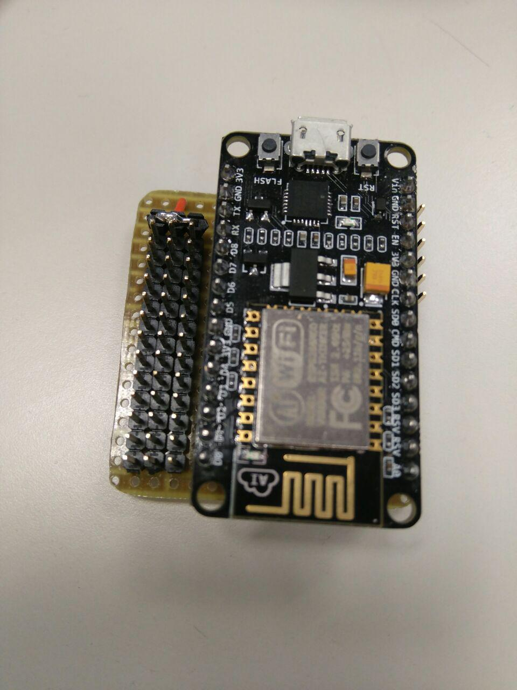

<table>
<tr>
<td>

</td>
</tr>
</table>

# NODE_WS  

board and app to move robots with NodeMCU via WiFi

## BOM
- NodeMCU [board](http://nodemcu.com/index_en.html)
- perfored PCB
- Headers

## Credits
 

Designed by Gianluca Pugliese [Owensource](https://www.owensource.com) for [BQ](https://www.bq.com)

## License

This robot is licensed under a [Creative Commons Attribution-ShareAlike 4.0 International License](http://creativecommons.org/licenses/by-sa/4.0/). Please read the LICENSE files for more details.

Este robot tiene una licencia [Creative Commons Attribution-ShareAlike 4.0 International License](http://creativecommons.org/licenses/by-sa/4.0/). Por favor, lea los ficheros LICENSE para más detalles
